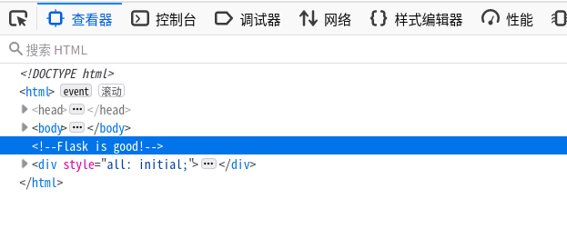
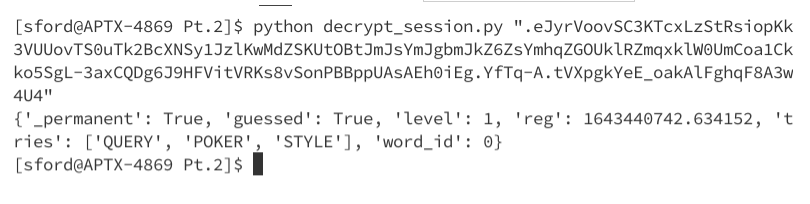
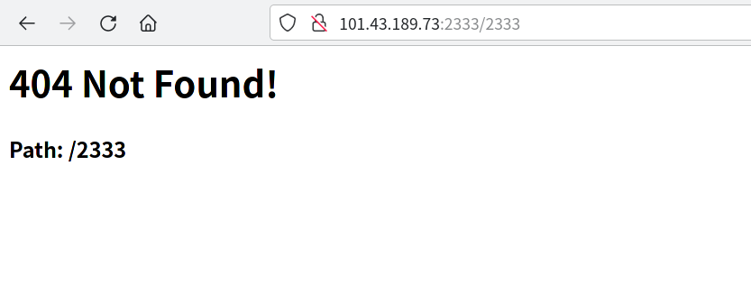
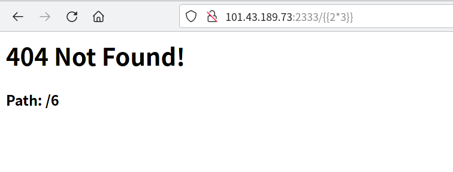
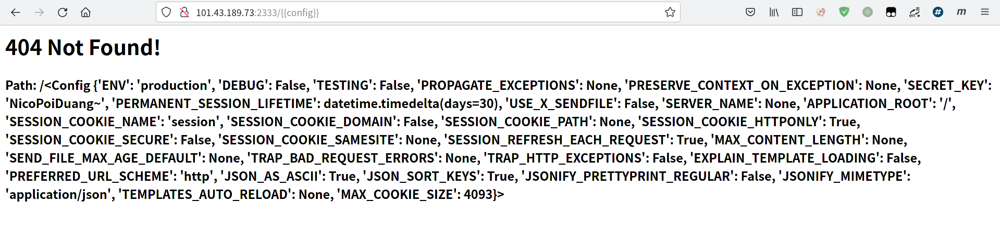
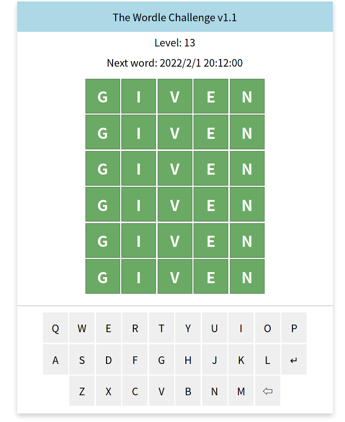

# Shelling 的 Wordle 挑战

这是 [Hello-2022](https://github.com/ShiSheng233/Hello-2022) 的第三题 [Wordle 挑战](https://github.com/ShiSheng233/Hello-2022/tree/main/test/Pt.2) 的升级版

源代码在这里: https://github.com/cjybyjk/wordle/ （写的很渣 qaq

~~*如果你每次都能猜对，那么只需要 `10 * 300 / 60 = 50` 小时就能获得 flag 了*~~

*50小时的话红包早就过期了(*

## 题解

用审查元素(F12)，可以发现页面底部有一个 “Flask is good!” 的注释

推测出这是用 Flask 编写的，而~~众所周知~~搜索可知 Flask 会将**签名但不加密**的 session 存储在客户端的 cookie 里

参考[这篇文章](https://bbs.ichunqiu.com/thread-53404-1-1.html)和[这篇文章](https://www.leavesongs.com/PENETRATION/client-session-security.html)，将浏览器 cookie 中的 session 放到文中的 Python 脚本里解码，会发现 session 其实是一个编码后的 json 字符串

注意到 session 中的 `level` 就是我们的等级。由于 Flask 是完全将 session 保存在客户端的，所以我们可以试着把它改成大等于 `300` 的值

但是 Flask 在生成 session 之后会对其进行签名，如果只修改了数据，就会导致校验不通过。

在原版中，我们可以使用 [Flask-Unsign](https://github.com/Paradoxis/Flask-Unsign) 来破解 secret_key，但是这只适合 secret_key 在 [Flask-Unsign 字典](https://github.com/Paradoxis/Flask-Unsign-Wordlist)里的情况

在v1.1版本中，Shelling 修复了弱 secret_key 的问题，也就是说 Flask-Unsign 无法再暴力破解出 secret_key 了

注意到更新日志里有一个 `新的 404 页面`，如果你尝试触发一个404，就会发现 404 页面中包含了当前试图访问的路径。（有经验的同学应该会意识到这可能是个 SSTI 注入点

搜索 `ctf Flask secret_key` 之类的关键字，可以找到有关 [**SSTI漏洞**](https://bing.com/search?q=SSTI%E6%BC%8F%E6%B4%9E) 的信息。猜测这是个 SSTI 注入点，进行测试：访问 `http://101.43.189.73:2333/{{2*3}}` ，会发现 404 页面中的 Path 变成了 6 ，这表示确实存在 SSTI

访问 `http://101.43.189.73:2333/{{config}}` ，即可得到 secret_key

使用这个 secret_key 来签名修改后的 session，将新的 session 放到 cookie 中，并刷新页面，可以得到 `flag{shelling_cute}` (快说Shelling cute (被打死(x

## 非预期解法 1

有推友找到了 Shelling 代码中的另一个漏洞（QAQ

Shelling 在 guess 接口里没有对当前是否已经猜中做出判断，因此如果玩家在猜中之后继续访问这个接口，会出现下图的效果

只要取得了单词列表（已经随 Hello-2022 公开了），就可以实现每小时升 36 级，因此只要 8 个小时就可以成功拿到 flag（

## 非预期解法 2
Shelling 不小心把包含 flag 的源码和题面一起传到了 github 上，虽然是 private 的仓库，但是还是可以通过 https://cjybyjk.github.io/wordle/main.py 下载到源码，从而得到 flag （

---

最后祝大家虎年大吉，虎虎生威~
